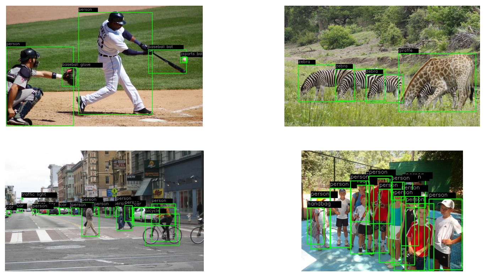
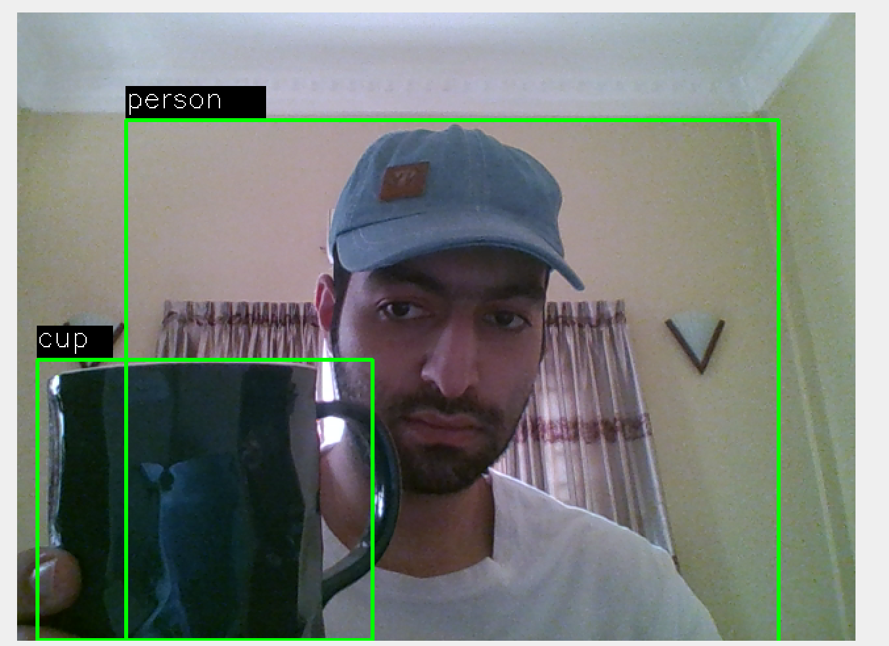

# Object Detection
Object detection which utilizes a pre-trained model from Tensorflow framework. The model has been tested on both image and camera.

## Results
<table>
  <tr>
    <td></td>
    <td></td>
  </tr>
</table>

## Run The Project

To run the project, run the following command

```bash
  pip install -r requirements.txt
```
then
```bash
  python app.py
```


